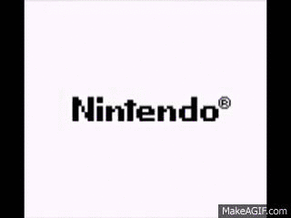
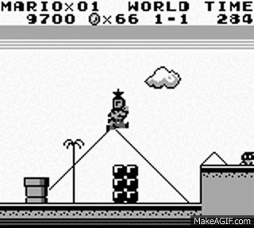
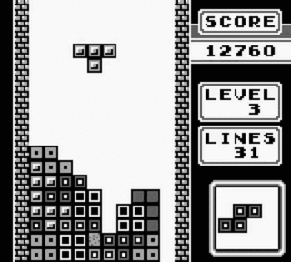
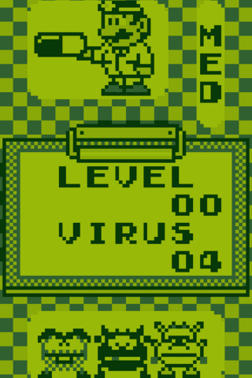

# gameboy

A Game Boy (DMG) emulator written in C++20.

 

<p align="center">
  
  
  
  
</p>

## Features

- **Full SM83 CPU** — all 256 base opcodes + all 256 CB-prefixed opcodes, with accurate cycle counts
- **PPU** — background, window, and sprite rendering with proper tile addressing, OAM sprite priority, and BG-over-OBJ flag
- **STAT interrupts** — unified interrupt line with rising-edge detection for modes 0/1/2 and LYC=LY coincidence
- **Timer** — DIV, TIMA, TMA, and TAC with correct reload behavior
- **Joypad** — full input handling with direction/action select lines
- **Boot ROM support** — optionally run the original DMG boot ROM to see the Nintendo logo scroll
- **HALT bug** — accurately emulates the hardware bug where HALT with IME=0 and pending interrupts causes the next opcode byte to be read twice
- **Frame-paced rendering** — SDL3 display at native 59.7 FPS with nearest-neighbor scaling

## Building

### Requirements

- CMake 3.12+
- A C++20 compiler (MSVC, GCC 10+, or Clang 11+)
- SDL3

### Build

```bash
mkdir build && cd build
cmake ..
cmake --build .
```

If SDL3 isn't found automatically, set the path in `CMakeLists.txt`:

```cmake
list(APPEND CMAKE_PREFIX_PATH "/path/to/SDL3/cmake")
```

## Usage

```bash
# Run a ROM
./gameboy <rom_file>

# Run with boot ROM (shows the Nintendo logo scroll)
./gameboy <rom_file> <boot_rom>
```

Example:

```bash
./gameboy tetris.gb
./gameboy tetris.gb dmg_boot.bin
```

## Controls

| Game Boy | Keyboard (Primary) | Keyboard (Alt) |
|----------|-------------------|-----------------|
| D-Pad    | Arrow keys        | WASD            |
| A        | Z                 | J               |
| B        | X                 | K               |
| Start    | Enter             |                 |
| Select   | Backspace         |                 |

## Architecture

```
main.cpp          Entry point, frame loop, ROM loading
gameboy.h         Top-level class wiring components together
cpu.h / cpu.cpp   SM83 CPU — registers, instruction decoding, interrupts
mmu.h             Memory map, boot ROM overlay, I/O registers, OAM DMA
ppu.h             Pixel Processing Unit — scanline renderer, sprites, STAT
timer.h           DIV/TIMA timer with configurable frequency
joypad.h          Button state and select-line multiplexing
sdl.h             SDL3 renderer and input polling
types.h           Type aliases (u8, u16, i8, etc.)
cartridge.h       Cartridge header parsing and MBC mappers (WIP)
```

## Compatibility

Currently supports **ROM-only** cartridges (no mapper). 2 Players seem bugged as well. Games like Tetris and Dr. Mario should work. MBC support (MBC1/MBC3/MBC5) is in progress, which will cover the majority of the Game Boy library.

## Roadmap

- [x] CPU — full instruction set with CB prefix
- [x] PPU — background, window, sprites
- [x] STAT interrupts with edge detection
- [x] Timer
- [x] Joypad input
- [x] Boot ROM support
- [x] HALT bug
- [ ] Cartridge MBC support (MBC1, MBC3, MBC5)
- [ ] Save files (.sav) for battery-backed cartridges
- [ ] Audio / APU
